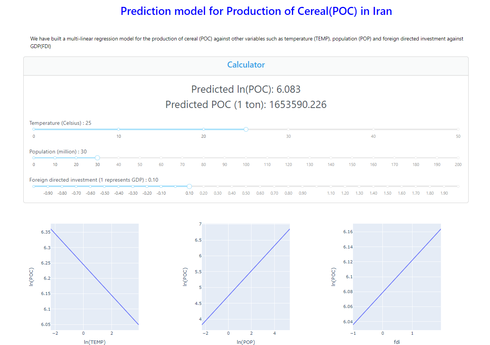

Installation

For windows
cd controller
python -m venv myenv
.\myenv\Scripts\Activate
pip install -r requirements.txt

For Linx/MacOS
cd controller
python -m venv myenv
source venv/bin/activate
pip install -r requirements.txt

Acknowledgement
https://www.fao.org/faostat/en/#country/102 Agriculture land 
https://climateknowledgeportal.worldbank.org/country/iran-islamic-rep/climate-data-historical rain + temp
https://data.un.org/Data.aspx?q=iran&d=PopDiv&f=variableID%3a12%3bcrID%3a364 Population
https://www.imf.org/external/datamapper/profile/IRN Private debt
https://www.imf.org/en/Publications/WEO/weo-database/2023/October/download-entire-database - Unemployment
https://www.macrotrends.net/countries/IRN/iran/economic-growth-rate - Economic growth (This was manually transcribed onto a csv file because the download button wasn't available)